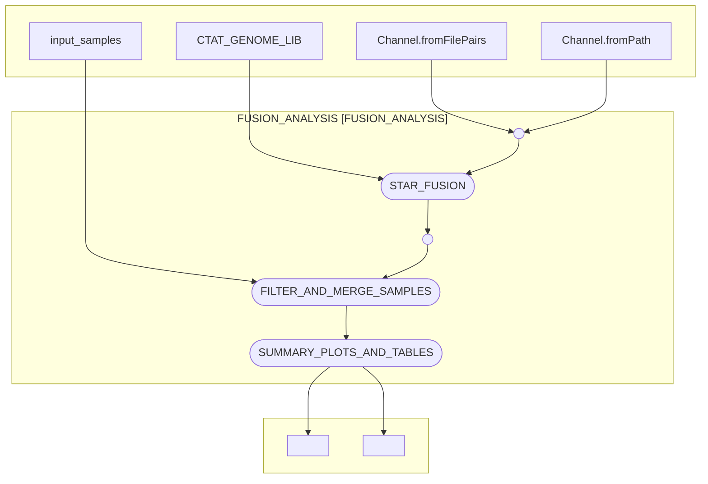

# dermatlas_rnafusions_nf

[](https://www.nextflow.io/)
[](https://www.docker.com/)
[](https://sylabs.io/docs/)

## Introduction

dermatlas_rnafusions_nf is a bioinformatics pipeline written in [Nextflow](http://www.nextflow.io) for identifying gene fusions in cohorts of tumors for the Dermatlas project.

## Pipeline summary

In brief, the pipeline takes a set fastq files from a Dermatlas cohort and
- Matches fastq files to patient metadata (PRIDs)
- Runs STAR-Fusion to identify RNA fusions
- Aggregates the results of STAR-fusuion into a single table
- Generates a report plotting fusion counts per sample and per gene

## Inputs 


### Cohort-dependent variables
- `fastq_path`: path to a top level directory containing a set of paired fastq files(R1 and R2). The pipeline will search for all fastq files within this directory and subdirectories.
- `sample_metadata`: path to a metadata file containing sample information. The metadata file should be a tab-separated file with the following columns:
    - `sample`: Unique Sanger identifier for each sample
    - `sample_supplier_name`: Dermatlas sample identifier for a tumour (PRID)
- `study_id`: Unique identifier for the study to append to any output summary files
- `sample_list`: A list of sDermatlas sample identifier to include in the analysis. Should match `sample_supplier_name` entries
### Cohort-independent variables

`ctat_lib` : path to a STAR-Fusion Trintity Cancer Transcriptome Analysis Toolkit (CTAT) genome build directory (a required input for STAR-Fusion)

Default reference file values supplied within the `nextflow.config` file can be overided by adding them to a local `.config` file. An example complete params file `tests/test_data/test_params.json` is supplied within this repository for demonstation.

## Usage 

The recommended way to launch this pipeline is using a wrapper script (e.g. `bsub < my_wrapper.sh`) that submits nextflow as a job and records the version (**e.g.** `-r 0.2.2`)  and the `.config` parameter file supplied for a run.

An example wrapper script:
```
#!/bin/bash
#BSUB -q oversubscribed
#BSUB -G team113-grp
#BSUB -R "select[mem>8000] rusage[mem=8000] span[hosts=1]"
#BSUB -M 8000
#BSUB -oo rna_fusions_%J.o
#BSUB -eo rna_fusions_%J.e

CONFIG="/lustre/scratch125/casm/team113da/users/jb63/nf_germline_testing/rna_fusions.config"

# Load module dependencies
module load nextflow-23.10.0
module load /software/modules/ISG/singularity/3.11.4

# Create a nextflow job that will spawn other jobs

nextflow run 'https://gitlab.internal.sanger.ac.uk/DERMATLAS/analysis-methods/dermatlas_rnafusions_nf' \
-r 0.2.2 \
-c ${CONFIG_FILE} \
-profile farm22 
```

The pipeline can configured to run on either Sanger OpenStack secure-lustre instances or the Sanger farm22 HPC by changing the profile speicified:
`-profile secure_lustre` or `-profile farm22`. 

## Pipeline visualisation 
Created using nextflow's in-built visualitation features.
nextflow run main.nf -preview -with-dag flowchart.mmd -params-file tests/testdata/test_params.json 



## Testing

This pipeline has been developed with the [nf-test](http://nf-test.com) testing framework. Unit tests and small test data are provided within the pipeline `test` subdirectory. A snapshot has been taken of the outputs of most steps in the pipeline to help detect regressions when editing. You can run all tests on openstack with:

```
nf-test test 
```
and individual tests with:
```
nf-test test tests/modules/ascat_exomes.nf.test
```

For faster testing of the flow of data through the pipeline **without running any of the tools involved**, stubs have been provided to mock the results of each succesful step.
```
nextflow run main.nf \
-params-file params.json \
-c tests/nextflow.config \
--stub-run
```


