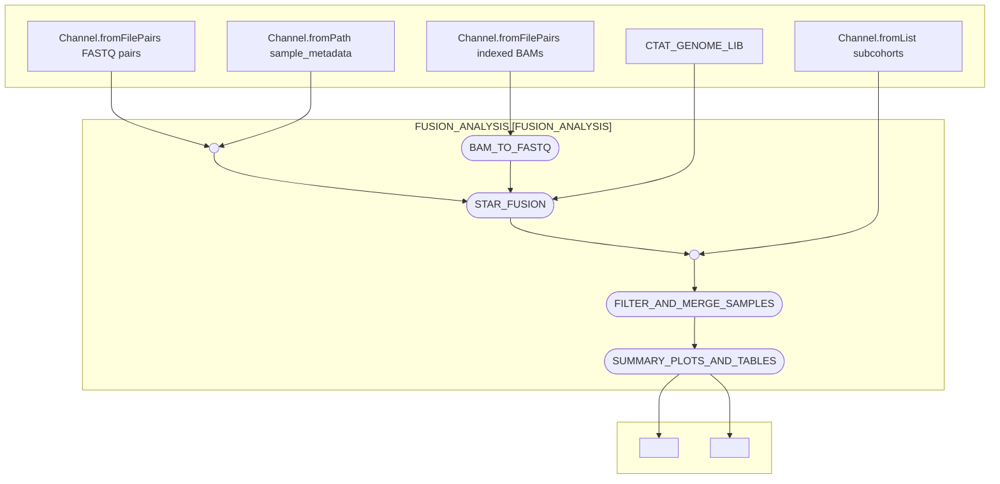

# dermatlas_rnafusions_nf

[](https://www.nextflow.io/)
[](https://www.docker.com/)
[](https://sylabs.io/docs/)

## Introduction

dermatlas_rnafusions_nf is a bioinformatics pipeline written in [Nextflow](http://www.nextflow.io) for identifying gene fusions in cohorts of tumors for the Dermatlas project.

## Pipeline summary

In brief, the pipeline takes a set fastq files (or indexed BAMs) from a Dermatlas cohort and
- Matches fastq files to patient metadata (PRIDs), or unwinds indexed BAMs to paired-end reads with samtools (deriving the PRID from the filename)
- Runs STAR-Fusion to identify RNA fusions
- Aggregates the results of STAR-Fusion into a merged table per subcohort
- Generates a report plotting fusion counts per sample and per gene for each subcohort


## Inputs 


### Cohort-dependent variables

Provide **exactly one** input mode, either `fastq_path` or `bam_path`:

- `fastq_path`: path to a top level directory containing a set of paired fastq files(R1 and R2). The pipeline will search for all fastq files within this directory and subdirectories. Requires `sample_metadata` to map Sanger ids to PRIDs.
- `bam_path`: glob matching a set of indexed BAMs **and** their `.bai` index files, e.g. `"/path/to/bams/**bam{,.bai}"`. Each BAM is unwound back to paired-end reads with `samtools` before STAR-Fusion. The patient id (PRID) is derived directly from the BAM filename, taking the prefix before the first dot (`PD1001.sample.dupmarked.bam` -> `PD1001`), so `sample_metadata` is not required in this mode.

    The glob must match **exactly two files per sample** — BAMs are paired by `Channel.fromFilePairs(..., size: 2)`, which silently drops any sample matching one file or three or more. In the Dermatlas layout each sample lives in its own subdirectory alongside `.bam.bas` and `.bam.met.gz` files, so `**` is needed to descend into those subdirectories and the `{,.bai}` brace is needed to exclude the other siblings. A looser glob such as `"/path/to/bams/*.bam*"` matches nothing usable and produces a run that succeeds with no output.
- `sample_metadata`: path to a metadata file containing sample information (only used with `fastq_path`). The metadata file should be a tab-separated file with the following columns:
    - `sample`: Unique Sanger identifier for each sample
    - `sample_supplier_name`: Dermatlas sample identifier for a tumour (PRID)
- `study_id`: Unique identifier for the study. Used as a prefix on all merged tables and summary plot filenames. **Required.**
- `subcohorts`: A map of one or more subcohorts to post-process from the same set of STAR-Fusion results. Each entry has a subcohort name (used as `cohort_id` and as the output sub-directory under `outdir`) and a `sample_list` path pointing to a TSV of Dermatlas sample identifiers matching `sample_supplier_name` entries. Example:

```groovy
subcohorts = [
    "one_per_patient": [ sample_list: "/path/to/one_per_patient_sampnames.tsv" ],
    "final_decision":  [ sample_list: "/path/to/final_decision_sampnames.tsv" ]
]
```
### Cohort-independent variables

`ctat_lib` : path to a STAR-Fusion Trintity Cancer Transcriptome Analysis Toolkit (CTAT) genome build directory (a required input for STAR-Fusion)

Default reference file values supplied within the `nextflow.config` file can be overided by adding them to a local `.config` file. An example complete params file `tests/testdata/test_params.json` is supplied within this repository for demonstation.

## Usage

Whether launched via the integrated website or manually, the pipeline is submitted the same way: `run_rna_fusions.sh` is piped into `bsub` as the
job script.

```bash
bsub -o "<stdout_log>" -e "<stderr_log>" \
     -g "<lsf_job_group>" -J "<job_name>" \
     < <dir>/run_rna_fusions.sh
```

Queue, resource group and memory come from the `#BSUB` directives inside the wrapper, so `bsub` adds only the job
name, job group and log paths. It is an ordinary bash script, so `bash run_rna_fusions.sh` also runs it in the
foreground on any farm node - the `#BSUB` lines are inert comments; `bsub` only makes it a batch job. Either way
it sources `./source_me.sh` relative to the directory it was started from.

Nearly all runs are triggered from the [Dermatlas cohorts page](https://team113.sanger.ac.uk/dermatlas/cohorts/),
which issues that command remotely against a project directory it has already provisioned - `source_me.sh`,
`run_rna_fusions.sh` and `rna_fusions.config` are all written for you. There is nothing to do by hand.

### Without the website

Clone the repo and supply what the website otherwise provisions: a project directory, the pipeline's
environment, and a couple of edits to the wrapper.

Only `bams/` has a required shape: the config globs `${BAMS_DIR}/**bam{,.bai}` and pairs exactly two files per
sample, so each sample needs its own sub-directory, and the PRID is the filename prefix before the first dot.
See [Inputs](#cohort-dependent-variables) for why a looser glob silently produces an empty run.

```
<project_dir>/                                   # PROJECT_DIR
├── bams/                                        # BAMS_DIR
│   ├── PD1001/
│   │   ├── PD1001.sample.dupmarked.bam          # matched -> PRID "PD1001"
│   │   ├── PD1001.sample.dupmarked.bam.bai      # matched
│   │   ├── PD1001.sample.dupmarked.bam.bas      # not matched by the glob
│   │   └── PD1001.sample.dupmarked.bam.met.gz   # not matched by the glob
│   └── PD1002/ ...
├── metadata/
│   ├── one_samp_ppat_sampnames.tsv              # one PRID per line
│   └── final_decision_sampnames.tsv
└── analysis/                                    # ANALYSIS_DIR; results land in analysis/star-fusion
```

The environment itself can come from a `source_me.sh` or from the wrapper directly. Both are supported; pick one.

<details>
<summary><strong>With a <code>source_me.sh</code></strong> - reusable across runs, and the shape the website generates</summary>

1. Write `source_me.sh` beside the wrapper in `assets/`, which is where the wrapper looks by default. With
   reporting opted out, these eight exports are the whole contract:

   ```bash
   export PROJECT_DIR="/lustre/.../6740_3016_MY_COHORT_RNA"
   export COMMANDS_DIR="${PROJECT_DIR}/commands"
   export ANALYSIS_DIR="${PROJECT_DIR}/analysis"
   export BAMS_DIR="${PROJECT_DIR}/bams"
   export STUDY="6740"     # prefixes output filenames, and the run id
   export PROJECT="3016"   # part of the run id
   export RNA_SAMPLE_LIST_ONE_PER_PATIENT="${PROJECT_DIR}/metadata/one_samp_ppat_sampnames.tsv"
   export RNA_SAMPLE_LIST_FINAL_DECISION="${PROJECT_DIR}/metadata/final_decision_sampnames.tsv"
   ```

2. In the wrapper, under **OPT-IN REPORTING** set `DERMATLAS_WEBSITE_LOGGING` and
   `DERMATLAS_SLACK_NOTIFICATIONS` to `"false"`, and under **RUN CONFIGURATION** point `CONFIG` at your
   `rna_fusions.config` and set `REVISION` to the release tag to run.

3. Submit from the directory holding `source_me.sh`:

   ```bash
   cd dermatlas_rnafusions_nf/assets
   bsub -o run.out -e run.err -J "rnafusion-<cohort>" < run_rna_fusions.sh
   ```

To override a single value without regenerating the file, uncomment just that variable in the wrapper's
**MANUAL ENVIRONMENT OVERRIDES** block - it is read after `source_me.sh`, so it wins.

</details>

<details>
<summary><strong>By editing <code>run_rna_fusions.sh</code> directly</strong> - self-contained, nothing to track outside the script</summary>

1. Under **ENVIRONMENT SETUP**, set `SOURCE_ME="none"` so the wrapper skips sourcing anything.

2. Under **MANUAL ENVIRONMENT OVERRIDES**, uncomment and fill in the pipeline-essential exports. With reporting
   opted out, these eight are the whole contract:

   ```bash
   export PROJECT_DIR="/lustre/.../6740_3016_MY_COHORT_RNA"
   export COMMANDS_DIR="${PROJECT_DIR}/commands"
   export ANALYSIS_DIR="${PROJECT_DIR}/analysis"
   export BAMS_DIR="${PROJECT_DIR}/bams"
   export STUDY="6740"     # prefixes output filenames, and the run id
   export PROJECT="3016"   # part of the run id
   export RNA_SAMPLE_LIST_ONE_PER_PATIENT="${PROJECT_DIR}/metadata/one_samp_ppat_sampnames.tsv"
   export RNA_SAMPLE_LIST_FINAL_DECISION="${PROJECT_DIR}/metadata/final_decision_sampnames.tsv"
   ```

3. Under **OPT-IN REPORTING** set `DERMATLAS_WEBSITE_LOGGING` and `DERMATLAS_SLACK_NOTIFICATIONS` to
   `"false"`, and under **RUN CONFIGURATION** point `CONFIG` at your `rna_fusions.config` and set `REVISION`
   to the release tag to run.

4. Submit from anywhere - with `SOURCE_ME="none"` there is no `source_me.sh` to be beside:

   ```bash
   bsub -o run.out -e run.err -J "rnafusion-<cohort>" < dermatlas_rnafusions_nf/assets/run_rna_fusions.sh
   ```

The same block is the annotated master list for either route - every variable with its purpose and an example
value, including the website- and Slack-only ones you would add if you opted back in.

</details>

`rna_fusions.config` reads these same variables, so it needs no editing unless you want different `subcohorts`
or `ctat_lib`. `REVISION` is fetched from GitHub, so your clone supplies the wrapper and config, not the
pipeline code - local edits to the workflow are not picked up until released.

The header of [`assets/run_rna_fusions.sh`](assets/run_rna_fusions.sh) maps every section and marks the
`[edit]` blocks, which are the only places you should need to touch.

### Toggles

| Variable | Default | Effect when `false` |
| --- | --- | --- |
| `DERMATLAS_WEBSITE_LOGGING` | `true` | no analysis-log record is written to the Dermatlas website |
| `DERMATLAS_SLACK_NOTIFICATIONS` | `true` | no Slack message on completion or failed launch |
| `DERMATLAS_CLEANUP_WORK_DIR` | `true` | this run's work directory is kept instead of deleted |

Work-directory cleanup only ever happens after a **successful** run; a failed one always keeps its work
directory. Cleanup relies on `params.publish_dir_mode = 'copy'`, and only ever removes the `work/` directory
the wrapper itself created.

None are required. Each is resolved from the environment, most specific first - a shell export beats
`source_me.sh`, which beats the default under **OPT-IN REPORTING** - so a single run can opt out without
editing anything:

```bash
export DERMATLAS_CLEANUP_WORK_DIR=false
bsub -o run.out -e run.err -J "rnafusion-<cohort>" < run_rna_fusions.sh
```

`true/false`, `yes/no`, `on/off` and `1/0` are all accepted in any case; anything else fails the launch
immediately rather than part-way through.

## Pipeline visualisation 
The flowchart below shows both supported input modes. Exactly one is used per run: either paired FASTQs matched to PRIDs via `sample_metadata`, or indexed BAMs that are unwound back to paired reads by `BAM_TO_FASTQ`. A base diagram can be regenerated with nextflow's in-built visualisation features:

```bash
nextflow run main.nf -preview -with-dag flowchart.mmd -params-file tests/testdata/test_params.json
```


```mermaid
flowchart TB
    subgraph " "
    v0["Channel.fromFilePairs FASTQ pairs"]
    v2["Channel.fromPath sample_metadata"]
    vb["Channel.fromFilePairs indexed BAMs"]
    v7["CTAT_GENOME_LIB"]
    v12["Channel.fromList subcohorts"]
    end
    subgraph "FUSION_ANALYSIS [FUSION_ANALYSIS]"
    vbf(["BAM_TO_FASTQ"])
    v8(["STAR_FUSION"])
    v18(["FILTER_AND_MERGE_SAMPLES"])
    v19(["SUMMARY_PLOTS_AND_TABLES"])
    v1(( ))
    v9(( ))
    end
    subgraph " "
    v20[" "]
    v21[" "]
    end
    v0 --> v1
    v2 --> v1
    v1 --> v8
    vb --> vbf
    vbf --> v8
    v7 --> v8
    v8 --> v9
    v12 --> v9
    v9 --> v18
    v18 --> v19
    v19 --> v21
    v19 --> v20
```

## Testing

This pipeline has been developed with the [nf-test](http://nf-test.com) testing framework. Unit tests and small test data are provided within the pipeline `test` subdirectory. A snapshot has been taken of the outputs of most steps in the pipeline to help detect regressions when editing. You can run all tests on openstack with:

```
nf-test test 
```
and individual tests with:
```
nf-test test tests/main.nf.test
```

For faster testing of the flow of data through the pipeline **without running any of the tools involved**, stubs have been provided to mock the results of each succesful step.
```
nextflow run main.nf \
-params-file tests/testdata/test_params.json \
-c tests/nextflow.config \
--stub-run
```

## Cutting a release

Cutting a new release requires a new semantic version tag, a changelog entry and
a commit of the updated version in every file that records it. 

### One-off setup, per clone

Releases go through `git hf` (HubFlow). If it is not on your `PATH`, `module load git`.
In a fresh clone, enable it once:

```bash
git hf init   # writes this clone's hubflow branch/prefix config; the defaults are correct
```

That is the only setup required.

### Steps

1. `git hf release start <version>`
2. `./.update-version.sh <version>` — sets the semantic version in every file that
   records it (`assets/run_rna_fusions.sh`, `docs/source/conf.py`, `nextflow.config`).
   Run `./.update-version.sh --help` for details. Commit the changes.
3. Update `CHANGELOG.md` and commit it.
4. `git hf release finish <version>`

## Asset release bundles

`assets/` is published to GitHub Releases as `projectify_asset_bundle.tar.gz` (plus a
`.sha256` of it) by `.github/workflows/publish-assets.yml`, so `dermanager projectify` can
fetch the files straight from the release CDN - no API call, no token, no rate limit:

```
https://github.com/team113sanger/dermatlas_rnafusions_nf/releases/download/<ref>/projectify_asset_bundle.tar.gz
```

| `<ref>` | Bundle contents | Updated |
| --- | --- | --- |
| `X.Y.Z` | `assets/` at that release tag | once, then immutable |
| `main-latest` | `assets/` at the head of `main`, i.e. the latest released state | every push to `main` |
| `develop-latest` | `assets/` at the head of `develop` | every push to `develop` |

The two `-latest` refs are fixed tags on pre-releases. Each push replaces the bundle attached
to the tag, so the download URL never changes and always serves that branch's current assets.

